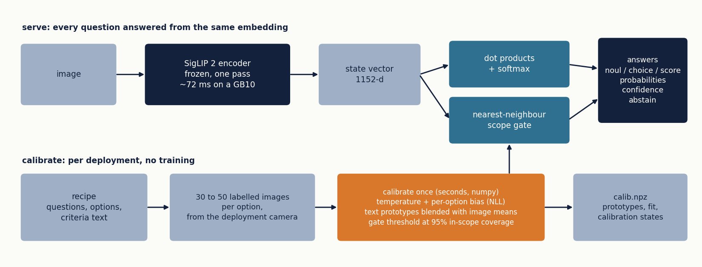
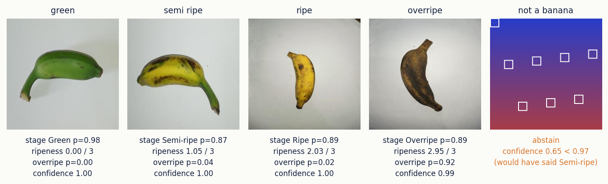
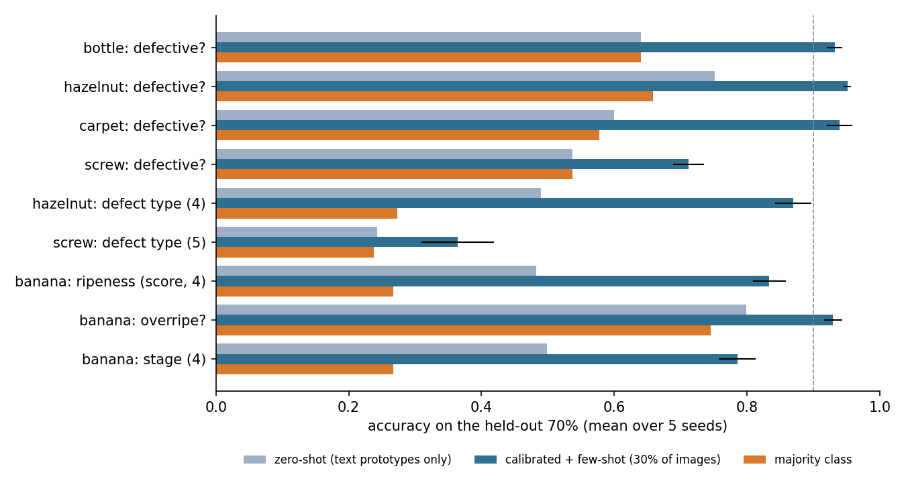
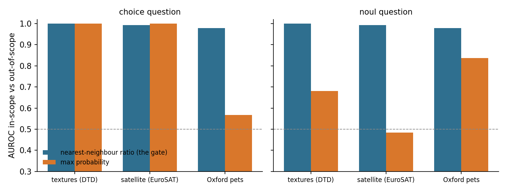

# certo-vision

Calibrated typed image decisions (`noul` / `choice` / `score`) with abstention, from a few dozen labelled
images, on a frozen SigLIP 2 backbone. One encoder pass answers the whole question schema.

[](report/report.pdf)
[](report/report.pdf)


-2F6F8F)
-brightgreen)




**What it is for.** Questions a person could answer from a thumbnail: is this part defective, which
ripeness stage, is the shelf empty, which of four packaging types. You give it 30 to 50 labelled images
per option from the deployment camera; it returns typed answers with calibrated probabilities, a scope
confidence and an abstain flag, in about 70 ms per image on a GB10 for any number of questions.

**What it is not for.** Fine detail: small defects, text, counting, spatial relations. The report shows
where that ceiling is (screw defects on MVTec AD: 0.71 yes/no, chance on type).

## Examples



```bash
certo-vision decide --recipe recipes/banana.json --calib demo/banana/calib.npz demo/banana/samples/*.png
```

One line of JSON per image (`demo/banana/decisions.jsonl` is this exact output from the Spark):

```json
{"image": "demo/banana/samples/overripe.png", "model": "certo-vision-0.1",
 "answers": {
   "ripeness": {"type": "score", "score": 2.952, "legend": {"0": "Green: unripe, fully green banana", "...": "..."},
                "probabilities": {"0": 0.0014, "1": 0.0139, "2": 0.0165, "3": 0.9683},
                "confidence": 0.9918, "calibrated": true, "abstain": false},
   "overripe": {"type": "noul", "noul": 0.9249, "confidence": 0.9918, "calibrated": true, "abstain": false},
   "stage":    {"type": "choice", "choice": "Overripe",
                "probabilities": {"Green": 0.0187, "Semi-ripe": 0.0717, "Ripe": 0.0201, "Overripe": 0.8895},
                "confidence": 0.9918, "calibrated": true, "abstain": false}},
 "timing_ms": {"embed": 79.6, "decide": 0.817}}
```

The same question set over HTTP, Jev-shaped. Questions can be named from the loaded recipe or given as full specs:

```bash
certo-vision serve --recipe recipes/banana.json --calib demo/banana/calib.npz --port 8080
curl -s localhost:8080/v1/systemone -H 'content-type: application/json' -d '{
  "state": {"image_b64": "'$(base64 < demo/banana/samples/not_a_banana.png | tr -d '\n')'"},
  "questions": ["overripe"]}'
```

```json
{"model": "certo-vision-0.1",
 "answers": {"overripe": {"type": "noul", "noul": 0.0142, "confidence": 0.6505, "calibrated": true, "abstain": true}},
 "timing_ms": {"embed": 75.6, "decide": 1.5}}
```

`abstain: true` is the gate saying the image is unlike anything it was calibrated on; the probability is still
returned, but the caller should not act on it.

From Python:

```python
from PIL import Image
from certo_vision import Decider, SiglipEmbedder
from certo_vision.recipe import load_recipe, specs

dec = Decider(SiglipEmbedder())                       # google/siglip2-so400m-patch14-384
dec.load("demo/banana/calib.npz")
qs = specs(load_recipe("recipes/banana.json"))        # {"ripeness": {...}, "overripe": {...}, "stage": {...}}
out = dec.decide({"image": Image.open("demo/banana/samples/ripe.png")}, qs)
out["answers"]["ripeness"]["score"], out["answers"]["stage"]["abstain"]   # (2.028, False)
```

Write your own recipe, drop labelled images in `images/<label>/`, and calibrate:

```bash
certo-vision calibrate --recipe my.json --images images --out my_calib.npz
```

## Results



| Question (SigLIP 2, 5 seeds) | zero-shot | **few-shot** | majority | ECE | OOD rejected |
|---|---|---|---|---|---|
| bottle: defective? | 0.640 | **0.932** | 0.640 | 0.056 | 100% |
| hazelnut: defective? | 0.751 | **0.951** | 0.658 | 0.033 | 100% |
| carpet: defective? | 0.600 | **0.940** | 0.578 | 0.051 | 100% |
| screw: defective? | 0.537 | **0.712** | 0.537 | 0.095 | 100% |
| hazelnut: defect type (4-way) | 0.490 | **0.869** | 0.274 | 0.098 | 100% |
| screw: defect type (5-way) | 0.243 | **0.364** | 0.238 | 0.131 | 100% |
| banana: ripeness (score, 4 levels; MAE 0.23) | 0.483 | **0.833** | 0.267 | 0.044 | 100% |
| banana: overripe? | 0.799 | **0.929** | 0.745 | 0.028 | 100% |

Coarse decisions pass; fine-grained ones hit the pooled-embedding ceiling; the scope gate rejected every
out-of-scope image, including other factory parts shot in the same style. Full tables, the backbone
comparison, the scope study and the caveats are in the [technical report](report/report.pdf)
([markdown](report/report.md)). Every number is read from `results/*.json`.



## Quickstart

```bash
pip install -e ".[siglip,serve]"            # torch, transformers, fastapi
python -m pytest tests                       # stub backbone, no weights needed
```

Lay out labelled images as `images/<label>/*.png`, write a recipe (see `recipes/banana.json`), calibrate:

```bash
certo-vision calibrate --recipe recipes/banana.json --images data/banana --out calib.npz
```

The command runs a 30% held-out check first and prints, per question, accuracy, calibration error,
the majority rate and the abstain rate, then refits on everything and saves one file. It warns when an
option has fewer than ten images.

Then `certo-vision decide` and `certo-vision serve` as in the examples above.

## Recipe format

```json
{
 "name": "banana",
 "questions": {
  "ripeness": {"type": "score", "instructions": "How ripe is the banana?",
               "criteria": ["Green: unripe, fully green", "Semi-ripe: ...", "Ripe: ...", "Overripe: ..."],
               "labels": {"Green": "0", "Semi-ripe": "1", "Ripe": "2", "Overripe": "3"}},
  "overripe": {"type": "noul", "instructions": "Is the banana overripe?",
               "criteria": {"true": "yes, brown spots or mostly brown", "false": "no, green, turning or cleanly yellow"},
               "labels": {"Overripe": "true", "*": "false"}},
  "stage":    {"type": "choice", "instructions": "Which ripeness stage?",
               "criteria": {"Green": "...", "Semi-ripe": "...", "Ripe": "...", "Overripe": "..."},
               "labels": "folder"}
 },
 "ood": {"textures": "data/ood/dtd"}
}
```

`type`, `instructions` and `criteria` are what the decider sees and what a served request must repeat
exactly to hit the saved calibration. `labels` maps image folders to option keys (`"folder"`: the folder
name is the key; `"*"`: every other folder). `ood` is optional and only used by `trial`.

## The recipe, in one paragraph

Embed the image once. Each option is a text prototype; probabilities are a softmax over dot products.
On the labelled images fit one temperature and one bias per option by NLL, and blend each text prototype
with the mean embedding of that option's images (0.7 text, 0.3 images). Keep the calibration embeddings;
confidence is the image's nearest-neighbour similarity to them relative to the set's own leave-one-out
median, and the abstain threshold is the 5th percentile of that over the set. The gate detects domain
shift, not off-topic questions, so calibration images must come from the deployment camera and the
abstain rate is reported next to accuracy.

## Evaluation

```bash
certo-vision trial --recipe recipes/mvtec_screw.json --images data/mvtec/screw --seeds 0 1 2 3 4
python -m benchmarks.stl10 --backbone siglip --images data/stl10 --classes-desc data/stl10/classes.json --seeds 0 1 2 3 4 --cache results/emb_siglip.npz
python -m benchmarks.oos_stl10 --backbone siglip --images data/stl10 --classes-desc data/stl10/classes.json --cache results/emb_siglip.npz --ood data/ood --out results/oos_siglip.json
python report/make_figures.py
```

`tools/make_*.py` export the public sets (STL-10, DTD, EuroSAT, Oxford-IIIT Pet, MVTec AD, BananaImageBD)
from the Hugging Face Hub into `root/<label>/*.png`. MVTec AD is CC BY-NC-SA 4.0 and is not redistributed
here; the banana demo images are from BananaImageBD (Project-AgML, CC BY 4.0).

## Layout

```
certo_vision/   decider (prototypes, calibration, gate, persistence), embedders, CLI, server, trial runner
recipes/        the question sets used in the report
demo/banana/    a calibration file and held-out samples to try the CLI immediately
results/        the JSON behind every number in the report
report/         report.md, report.pdf, figures and the scripts that make them
benchmarks/     STL-10 backbone comparison and out-of-scope study
tools/          dataset export, HTTP helper, the end-to-end release check
tests/          pipeline tests on a deterministic stub embedder (no weights)
```

## Citation

```
@techreport{rajput2026certovision,
  title  = {certo-vision: calibrated typed image decisions from a few dozen labelled images},
  author = {Rajput, Dushyant},
  institution = {altslate labs},
  year   = {2026},
  url    = {https://github.com/AltSlate-Labs/certo-vision}
}
```

Part of the Certo line of small calibrated decision models ([certo](https://github.com/AltSlate-Labs/certo) for text).
