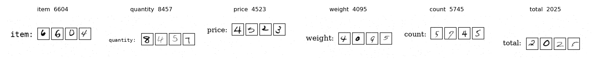
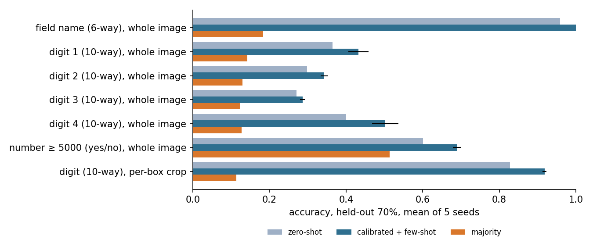

# Example: a printed field name and four handwritten digits

The question from a colleague: a form has four square boxes holding a handwritten number from 0 to 9999,
with an English field name printed in front of them (item, quantity, ...). Can the decider read both?



**Data.** `data/` holds 600 synthetic 384 px form snippets: one of six field names (item, quantity, price,
weight, count, total) in a random font and size, then four boxes each containing one MNIST digit, resized,
rotated a few degrees and jittered, with light scanner-style noise. `data/labels.json` has the field name,
the four digits, the number and the box coordinates for every image. `make_forms.py` regenerates it
(MNIST from the Hub, `ylecun/mnist`). The field name is printed, not handwritten; that is the one
assumption made here.

**Two readings.** Whole image: the standard decider over the full snippet, one question per field. Per-box
crop: the known box coordinates are used to crop each box, and one 10-way digit question is asked per
crop, calibrated on crops from the calibration forms. Protocol as in the report: 30/70 split by form,
five seeds, majority baseline, SigLIP 2 on the DGX Spark. `run.py` produces `results.json`.

## Results

| Question | zero-shot | calibrated | few-shot | majority | ECE few-shot |
|---|---|---|---|---|---|
| field name (6-way), whole image | 0.959 | 1.000 | **1.000** ± 0.000 | 0.183 | 0.003 |
| digit 1 of 4 (10-way), whole image | 0.364 | 0.386 | **0.432** ± 0.027 | 0.142 | 0.140 |
| digit 2 of 4 (10-way), whole image | 0.298 | 0.287 | **0.343** ± 0.010 | 0.129 | 0.168 |
| digit 3 of 4 (10-way), whole image | 0.270 | 0.257 | **0.287** ± 0.007 | 0.122 | 0.206 |
| digit 4 of 4 (10-way), whole image | 0.401 | 0.461 | **0.502** ± 0.034 | 0.127 | 0.136 |
| number ≥ 5000 (yes/no), whole image | 0.601 | 0.649 | **0.690** ± 0.011 | 0.513 | 0.060 |
| digit (10-way), per-box crop, n = 2400 | 0.828 | 0.846 | **0.918** ± 0.005 | 0.113 | 0.029 |

Whole four-digit number correct from the four crop decisions: **0.707 ± 0.012** (0.918⁴ ≈ 0.71, so the
errors are independent across boxes).

### Range questions

The natural follow-up: can it answer "which range is the number in" from the image? `range.py` asks a
four-bin range question (0–2499, 2500–4999, 5000–7499, 7500–9999) two ways.

| Range question | zero-shot | few-shot | majority |
|---|---|---|---|
| 4-bin range, whole image (choice) | 0.280 | **0.432** ± 0.025 | 0.284 |
| number ≥ 5000, whole image (noul) | 0.601 | **0.690** ± 0.011 | 0.513 |
| 4-bin range, derived from the four crop decisions | | **0.917** ± 0.006 | |
| number ≥ 5000, derived from the crop decisions | | **0.940** ± 0.006 | |

Through the whole image a range question barely beats guessing. From the crops it is as good as the
first-digit read (0.917), because a range is mostly a question about the leading digit.



## Reading

- **The printed word is solved.** SigLIP 2 reads printed text; six-way field name is 96% zero-shot and
  100% after calibration. Any question of the form "which of these printed labels" is in scope.
- **Handwritten digits through the whole image are not.** 29 to 50% on a 10-way question, well above the
  13% majority rate, so the embedding carries some digit information, but nowhere near usable, and the
  calibration error is the worst in the repo (0.14 to 0.21). The outer boxes do better than the inner
  ones. This is the pooled-embedding ceiling from the report, measured on the simplest fine-detail task
  there is.
- **Crop first, then decide.** With the box located, one digit per crop is 92% with 180 calibration
  crops per class, and 83% zero-shot. The whole number is right 71% of the time. That is the shape of a
  working system for this form: a localiser (fixed template, or a detector) in front of the decider,
  one typed question per box. Pushing per-digit accuracy from 92% toward the 99% that MNIST models
  reach is a job for a digit classifier, not for a frozen image-text encoder.
- **What to promise.** Field names: yes. Numbers: only with a crop step, and then at about 92% per digit
  on this synthetic set. Real handwriting on real scans will be lower until calibrated on that source.

## Reproduce

```bash
python examples/forms/make_forms.py --out examples/forms/data --n 600       # or use the committed data
python examples/forms/run.py --data examples/forms/data --model google/siglip2-so400m-patch14-384 --out examples/forms/results.json
python examples/forms/range.py --data examples/forms/data --cache results/cache/forms_siglip.npz --model google/siglip2-so400m-patch14-384
python examples/forms/make_figure.py
```
