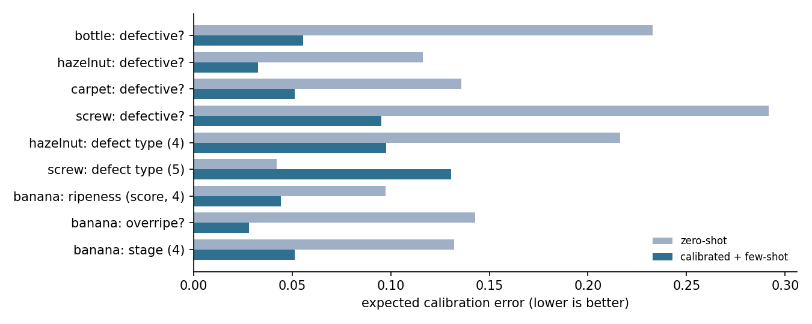

## Abstract

Many product decisions about an image are small and typed: *is this part defective?*, *which of these
four defect types is it?*, *how ripe is this fruit on a four-level scale?* They need three things a
generative vision-language model does not give cheaply: a calibrated probability, a separate statement of
whether the model is in its depth, and a refusal when it is not.

certo-vision is a small decision layer over a frozen SigLIP 2 image-text encoder. It answers `noul`
(yes/no), `choice` and `score` questions from one embedding pass, fits a per-question temperature and
per-option bias on a few dozen labelled images, blends text prototypes with image prototypes, and gates
every answer with a nearest-neighbour scope check set to keep 95% of in-scope images.

On nine questions from two public datasets that resemble client work (MVTec AD industrial inspection,
banana ripeness) it reaches 93 to 95% on gross yes/no defect questions, 0.87 on a four-way defect type,
and a mean absolute error of 0.23 levels on a four-level ripeness score, while rejecting 100% of
out-of-scope images. It fails on subtle defects of a small part (screw: 0.71 yes/no, chance on type),
which locates the ceiling of pooled embeddings.

The code, calibration recipe, demo calibration, evaluation harness, every result file and this report are
public under Apache-2.0 at [github.com/AltSlate-Labs/certo-vision](https://github.com/AltSlate-Labs/certo-vision).

## Results at a glance

| Finding | Evidence | Where |
|---|---|---|
| Coarse visual decisions work from 20 to 45 labelled images per option | 0.93 to 0.95 yes/no on bottle, hazelnut, carpet, banana; ripeness within 0.23 levels | §4.2 |
| Fine detail does not | screw defects 0.71 yes/no, chance on type; handwritten digits 29 to 50% through the whole image | §4.2, §4.4 |
| The labelled images are the product, not the text prompts | zero-shot sits at the majority rate on industrial yes/no; few-shot blending carries almost all the gain | §4.1, §4.2 |
| The scope gate rejects what it has not seen | 100% of out-of-scope images rejected at 9% in-scope abstain; nearest-neighbour ratio AUROC ≥ 0.98 | §4.3 |
| The gate detects domain shift, not off-topic questions | rejects 93% of high-resolution pet photos that the model answers correctly | §4.3 |
| Two popular confidence signals are useless for scope | max probability exceeds 0.9 on 97 to 100% of textures; truncated-width agreement is near coin-flip | §4.3 |
| For digits, a dedicated reader beats the embedding | per-box crops: prototype head 0.918 per digit, ridge probe 0.961, small CNN fine-tuned on calibration crops 0.979 | §4.4 |

**Terms used below.** `noul`: a yes/no question answered with a probability. `choice`: one of several
named options. `score`: an ordinal level with a legend. ECE: expected calibration error, the gap between
stated probability and observed accuracy, lower is better. AUROC: how well a signal separates two sets,
1.0 is perfect, 0.5 is chance. OOD: out-of-distribution, images unlike the calibration set. MRL: Matryoshka
representation learning, embeddings whose prefixes are usable on their own.

## 1. The contract

*A typed answer per question, plus a scope score and an abstain flag, all from one embedding.*

A typed decision API (as popularised by Jev from TypeSafe AI for text) takes one *state* and a schema of
questions, and returns for each question a value of the declared type with calibrated probabilities. The
caller never parses free text. We keep that contract for images and add two fields the caller can act on:

- `confidence`: how close the image is to the images the question was calibrated on. This is a scope
  score, not the answer probability.
- `abstain`: whether `confidence` is below a threshold fitted to keep 95% of in-scope images.

The design constraint is cost. Every question is answered from the same embedding of the image, so a
schema of fifty questions costs one encoder pass plus fifty dot products. That makes it viable to put ten
or twenty typed checks on every frame or every upload, which a generative model call per question is not.

## 2. Method

*Frozen encoder, text prototypes refined by a few labelled images, a fitted temperature and bias, and a
nearest-neighbour gate.*

1. **Backbone.** `google/siglip2-so400m-patch14-384` (about 1.1 B parameters, 1152-d joint image-text
   space), frozen. An earlier prototype used EmbeddingGemma 2; §4.1 reports the comparison that settled
   the choice.
2. **Prototypes.** Each option of a question is rendered as a short text ("Is the banana overripe? — yes,
   the banana is overripe with brown spots or mostly brown") and embedded once. Probabilities are a softmax
   over the dot products between the unit image embedding and the unit option prototypes.
3. **Calibration.** On a labelled calibration set we fit one temperature and one bias per option by
   minimising negative log-likelihood (plain gradient descent on at most 256 parameters). This stands in
   for the reinforcement-learned calibration a text decision model gets at training time; here it is
   cheap enough to run per deployment.
4. **Few-shot prototypes.** With the same labelled images, each text prototype is blended with the mean
   embedding of that option's images, `p ← norm(0.7·p_text + 0.3·mean_img)`, the Tip-Adapter idea reduced
   to one line. This step carries almost all the gain (§4.2).
5. **Scope gate.** The calibration embeddings are kept. For a new image, `confidence` is its highest
   cosine similarity to any calibration image, divided by the median leave-one-out nearest-neighbour
   similarity within the calibration set, clipped to [0, 1]. The abstain threshold is the 5th percentile
   of that quantity over the calibration set itself. Nothing about the gate depends on the labels.
6. **Score questions** return the expected level under the calibrated distribution, with the legend.
7. **Persistence.** Prototypes, temperature, bias, calibration embeddings and the threshold are saved to
   one file and loaded by the server. A served request matches a saved question by its id and its exact
   spec, so a schema edit silently drops back to zero-shot and is reported as `calibrated: false`.

## 3. Protocol

*Five seeds, a majority baseline on every row, calibration metrics next to accuracy, and scope measured
against named out-of-scope sets.*

- **Splits.** Every image set is split 30% calibration / 70% test, redrawn for each of five seeds. We report
  mean ± standard deviation over seeds and always the majority-class rate of the test split.
- **Variants.** Three per question: zero-shot (text prototypes, default temperature), calibrated (fit on
  the 30%), calibrated + few-shot (fit and blend on the same 30%).
- **Metrics.** Accuracy, negative log-likelihood, Brier score, ECE (15 bins), area under the risk-coverage
  curve; for score questions also mean absolute error in levels and Spearman ρ.
- **Scope.** The gate is fitted on the seed-0 calibration split. We report the in-scope abstain rate on the
  test split, and for each out-of-scope set the AUROC of in-scope versus out-of-scope confidence and the
  fraction rejected at the fitted threshold.
- **Data.** STL-10 (10 classes, 100 per class, 96 px) for the backbone comparison, with DTD textures,
  EuroSAT satellite tiles and Oxford-IIIT pet photos (200 each) as out-of-scope sets. MVTec AD bottle,
  hazelnut, carpet and screw (100 good training images plus the full test split per object) and the
  BananaImageBD ripeness set (150 per level, four levels) for the trial. Out-of-scope sets for the trial
  are the *good* images of the other three MVTec objects, DTD and STL-10 cats.
- **Hardware.** One NVIDIA GB10 (DGX Spark). Embeddings are computed once and cached; everything else is
  numpy.

## 4. Results

### 4.1 Backbone: SigLIP 2 over EmbeddingGemma 2

*SigLIP 2 is better on every task and variant, faster, and carries no audio weights.*

| Backbone | task | zero-shot | calibrated | few-shot | majority | ECE few-shot | embed ms |
|---|---|---|---|---|---|---|---|
| SigLIP 2 so400m | subject (10-way) | 0.990 | 0.993 | **0.995** ± 0.001 | 0.110 | 0.005 | 72 |
| SigLIP 2 so400m | is it a cat? | 0.900 | 0.900 | **0.990** ± 0.005 | 0.900 | 0.016 | 72 |
| SigLIP 2 so400m | blur level (5, synthetic) | 0.247 | 0.340 | **0.878** ± 0.004 | 0.207 | 0.028 | 72 |
| EmbeddingGemma 2 | subject (10-way) | 0.967 | 0.983 | **0.988** ± 0.002 | 0.110 | 0.011 | 84 |
| EmbeddingGemma 2 | is it a cat? | 0.126 | 0.900 | **0.964** ± 0.021 | 0.900 | 0.033 | 84 |
| EmbeddingGemma 2 | blur level (5, synthetic) | 0.232 | 0.202 | **0.857** ± 0.015 | 0.207 | 0.043 | 84 |

Table 1. STL-10, 1000 images, five seeds, embed time at batch size one on the GB10. The zero-shot `noul`
on EmbeddingGemma 2 (0.126) answers "yes" to nearly everything: the negated prototype does not work there.

Two things are visible already. A calibrated `noul` without image prototypes equals the majority rate
exactly (0.900 on both backbones): temperature and bias cannot add information, they only reshape the
prior. And the synthetic blur score goes from chance to 0.88 only once image prototypes are blended in.

### 4.2 Trial on public stand-ins for client questions

*Coarse decisions pass at 0.93 to 0.95. Subtle defects on a small part fail. Zero-shot is not a product.*

| Question | type | n | calib / option | zero-shot | calibrated | few-shot | majority | ECE few-shot |
|---|---|---|---|---|---|---|---|---|
| bottle: defective? | noul | 183 | 19 | 0.640 | 0.874 | **0.932** ± 0.011 | 0.640 | 0.056 |
| hazelnut: defective? | noul | 210 | 21 | 0.751 | 0.950 | **0.951** ± 0.006 | 0.658 | 0.033 |
| carpet: defective? | noul | 217 | 27 | 0.600 | 0.641 | **0.940** ± 0.019 | 0.578 | 0.051 |
| screw: defective? | noul | 260 | 36 | 0.537 | 0.617 | **0.712** ± 0.024 | 0.537 | 0.095 |
| hazelnut: defect type (4) | choice | 70 | 5 | 0.490 | 0.837 | **0.869** ± 0.027 | 0.274 | 0.098 |
| screw: defect type (5) | choice | 119 | 7 | 0.243 | 0.200 | **0.364** ± 0.054 | 0.238 | 0.131 |
| banana: ripeness (score, 4) | score | 600 | 45 | 0.483 | 0.626 | **0.833** ± 0.025 | 0.267 | 0.044 |
| banana: overripe? | noul | 600 | 45 | 0.799 | 0.801 | **0.929** ± 0.014 | 0.745 | 0.028 |
| banana: stage (4) | choice | 600 | 45 | 0.499 | 0.600 | **0.785** ± 0.028 | 0.267 | 0.051 |

Table 2a. Accuracy. SigLIP 2, five seeds, 30/70 split. "calib / option" is the smallest number of
calibration images any option received. The ripeness score has MAE 0.23 levels and Spearman ρ 0.90.

| Recipe | in-scope abstain | out-of-scope sets | OOD images | rejected |
|---|---|---|---|---|
| bottle | 0.10 | hazelnut, carpet, screw (good), DTD, STL-10 cats | 659 | 100% |
| hazelnut | 0.06 to 0.10 | bottle, carpet, screw (good), DTD, STL-10 cats | 639 | 100% |
| carpet | 0.05 | bottle, hazelnut, screw (good), DTD, STL-10 cats | 651 | 100% |
| screw | 0.02 to 0.04 | bottle, hazelnut, carpet (good), DTD, STL-10 cats | 638 | 100% |
| banana | 0.09 | bottle (good), DTD, STL-10 cats | 370 | 100% |

Table 2b. Scope on the same trial. "rejected" is the lowest rejection rate over that recipe's out-of-scope
sets at the threshold fitted for 95% in-scope coverage.




**Coarse decisions pass.** Gross defects on bottle, hazelnut and carpet and the two banana yes/no or score
questions land between 0.93 and 0.95 with 19 to 45 calibration images per option. The ripeness score, the
first test of the `score` type on real ordinal labels, is within a quarter of a level on average. ECE after
calibration is 0.03 to 0.06 on these rows.

**Fine-grained decisions fail.** The screw set is thread damage, scratches and tip chips on a small object
against a plain background. A pooled 1152-d embedding of the whole image does not retain that detail:
0.71 on yes/no and chance on type, with the worst calibration of the table. Patch-level methods on MVTec
(WinCLIP, PatchCore) solve exactly this, and that is the path if such questions are in scope.

**Zero-shot is not a product.** On the industrial yes/no questions it is at or within two points of the
majority rate, and on the banana questions it is 25 to 35 points under few-shot. Its ECE is 0.2 to 0.4
everywhere. The labelled images are the product; the text prototypes are a prior that the images refine.

**Thin options are noisy.** The defect-type rows had five to seven calibration images per option, and
their seed spreads run to 5 points. Treat those rows as indicative; the calibration tool warns below ten
images per option.

### 4.3 Scope: what the gate detects

*The nearest-neighbour ratio is the whole signal. It detects domain shift, not off-topic questions.*

| question | out-of-scope set | AUROC NN ratio | AUROC max-prob | AUROC MRL agreement | rejected by NN gate | max-prob > 0.9 |
|---|---|---|---|---|---|---|
| choice | textures (DTD) | 1.000 | 0.999 | 0.722 | 100% | 1% |
| choice | satellite (EuroSAT) | 0.992 | 1.000 | 0.669 | 100% | 0% |
| choice | Oxford pets | 0.979 | 0.567 | 0.352 | 93% | 100% |
| noul | textures (DTD) | 1.000 | 0.680 | 0.625 | 100% | 97% |
| noul | satellite (EuroSAT) | 0.992 | 0.484 | 0.600 | 100% | 100% |
| noul | Oxford pets | 0.979 | 0.837 | 0.882 | 93% | 79% |

Table 3. SigLIP 2, STL-10 questions calibrated on 300 images (seed 0); 700 in-scope test images vs 200 per
out-of-scope set. "MRL agreement" is the agreement between answers at truncated embedding widths (128 to
full). EmbeddingGemma 2 shows the same pattern (NN ratio AUROC 0.996 to 1.000, max-prob 0.36 to 0.99);
the rows are in `results/oos_gemma.json`.


Three conclusions:

- **The nearest-neighbour ratio is the whole signal.** AUROC ≥ 0.98 on every set and every question,
  rejecting 93 to 100% at 95% in-scope coverage.
- **Max probability is useless as a scope signal on `noul` questions.** 97 to 100% of the answers on
  textures and satellite tiles exceed 0.9.
- **Agreement across truncated widths is near coin-flip** and was removed from the confidence.

The Oxford pets row is the important caveat. Those are cats and dogs, the question is "is it a cat?", and
the model answers them mostly correctly. The gate still rejects 93% of them because they are
high-resolution photographs and the calibration set is 96-pixel STL-10. **The gate detects domain shift,
not off-topic questions.** For deployment that means calibration images must come from the deployment
camera, and the in-scope abstain rate must be reported as a first-class metric next to accuracy. The trial
in §4.2 is the favourable case: its out-of-scope sets include the other MVTec objects, shot in the same
style, and the gate still rejected all of them.

### 4.4 Where the ceiling is: a form with handwritten digits

*Printed words are in scope. Handwritten digits need a crop step, and beyond 92% per digit a dedicated
reader.*

A worked example in the repository (`examples/forms/`) puts a number on the fine-detail limit. 600
synthetic form snippets carry a printed field name (six options) and four boxes with MNIST digits.

| Reading | field name | per digit | whole number | range, 4 bins | number ≥ 5000 |
|---|---|---|---|---|---|
| whole image, one question per box | 1.000 | 0.29 to 0.50 | | 0.432 | 0.690 |
| crop each box, one digit question per crop | | 0.918 ± 0.005 | 0.707 | 0.917 | 0.940 |
| crops, ridge probe on the same SigLIP 2 features | | 0.961 | 0.851 | | |
| crops, 1.2M-parameter CNN pretrained on MNIST | | 0.966 | 0.872 | | |
| the same CNN fine-tuned on the 720 calibration crops | | **0.979** | **0.921** | | |

Table 4. Five seeds, 30/70 split on the 600 forms. Zero-shot on the field name is 0.96; the majority rate for the range question is 0.28 and for "≥ 5000" 0.51. The crop-row range and threshold figures are derived from the four digit decisions.

Through the whole image, the digits have the worst calibration error in this report. Doubling the
calibration crops does not move the prototype head, so its limit is the pooled feature, not the data. A
properly regularised linear probe on the same features recovers four points; a purpose-built digit network
fine-tuned on the deployment's own handwriting takes the whole number from 71 to 92%. The network trains in
seconds on the GB10 and can be served behind the same typed question with a temperature-calibrated softmax.

### 4.5 Cost

Embedding one image takes 72 ms at batch size one on the GB10 (fp32, no compilation). Answering the whole
schema afterwards is about 1 ms for two questions and grows linearly in the number of options. The
calibration file for the three-question banana demo is a few megabytes and loads in milliseconds.

## 5. What this does and does not show

**Shown.** A frozen image-text encoder with per-question calibration and few-shot prototypes gives usable,
calibrated typed decisions on coarse visual questions from a few dozen labelled images, with a scope gate
that reliably rejects images unlike the calibration set.

**Not shown.**

- **Cross-camera transfer.** Every trial calibrates and tests on the same source. The pets result says the
  gate will reject a different camera; we have not measured how much accuracy survives when the gate is
  re-fitted on the new camera. This is the first thing to test on a real client set.
- **Comparison to a VLM.** We did not run a generative vision-language model on the same typed questions.
  The claim is cost and calibration, not that a VLM would be less accurate.
- **Fine detail.** The screw failure is diagnosed, not fixed. The forms example shows the same limit on
  handwritten digits and measures what a dedicated reader recovers; a trained token-level pooling head or
  a patch-based fallback for defects is out of scope for this release.
- **Ordinal scores beyond one dataset.** The blur score is synthetic; the ripeness score is one real set.
- **Thin options.** Defect-type rows had under ten calibration images per option.

## 6. Release scope and availability

*Give it thirty to fifty labelled images per option from the deployment camera; get calibrated typed
answers and an abstain flag, for questions a person could answer from a thumbnail.*

Questions that need fine detail (small defects, text, counting, spatial relations) are outside that promise
and should route to a different model. The calibration command runs a held-out check and prints accuracy,
calibration error, majority rate and abstain rate before saving anything, so the scope is checked per
deployment, not assumed.

The release is public at [github.com/AltSlate-Labs/certo-vision](https://github.com/AltSlate-Labs/certo-vision)
under Apache-2.0. It contains the package and CLI (`calibrate`, `decide`, `serve`, `trial`), the recipes
used here, a demo calibration on the banana set with held-out samples, the forms example with its data,
every result file this report reads from, the figure scripts, and an end-to-end release check that
reproduces the trial numbers from cached embeddings. There are no trained weights to release: the only
learned state is the per-deployment calibration file.

## 7. Related work

Prototype classifiers over CLIP-style encoders and their few-shot refinements (CoOp, Tip-Adapter) are the
basis of the prototype and blending steps. Temperature scaling (Guo et al.) is the calibration step,
extended with a per-option bias. Nearest-neighbour distance as an out-of-distribution score (Sun et al.) is
the gate. That pooled embeddings miss small defects on MVTec AD, and that patch-level matching fixes it, is
established by WinCLIP and PatchCore. The typed decision contract with calibrated probabilities and a
separate confidence follows Jev (TypeSafe AI) for text. The contribution here is the combination into one
cheap, calibrated, abstaining decision layer, the evaluation protocol with majority baselines and scope
metrics, and the negative results on zero-shot prototypes and on max-probability and truncation-agreement
as scope signals.

## 8. Reproduction

```bash
pip install -e ".[siglip,serve,dev]"
python -m pytest tests                                   # stub backbone, no weights
# data export (public sets, into data/)
python tools/make_mvtec.py --out data/mvtec --objects bottle screw hazelnut carpet --good-train 100
python tools/make_banana.py --out data/banana --per-class 150
# trial, five seeds, cached embeddings
certo-vision trial --recipe recipes/banana.json --images data/banana --seeds 0 1 2 3 4
# calibrate for serving, with the held-out check
certo-vision calibrate --recipe recipes/banana.json --images data/banana --out calib.npz
certo-vision serve --calib calib.npz --recipe recipes/banana.json --port 8080
python report/make_figures.py                            # figures and tables from results/
bash tools/release_check.sh                              # end-to-end, reproduces Table 2 banana rows
```

`results/` holds the JSON every number in this report was read from.

## References

- Tschannen, M. et al. *SigLIP 2: Multilingual Vision-Language Encoders with Improved Semantic Understanding, Localization, and Dense Features.* 2025.
- Zhang, R. et al. *Tip-Adapter: Training-free Adaption of CLIP for Few-shot Classification.* ECCV 2022.
- Zhou, K. et al. *Learning to Prompt for Vision-Language Models (CoOp).* IJCV 2022.
- Guo, C. et al. *On Calibration of Modern Neural Networks.* ICML 2017.
- Sun, Y. et al. *Out-of-Distribution Detection with Deep Nearest Neighbors.* ICML 2022.
- Jeong, J. et al. *WinCLIP: Zero-/Few-Shot Anomaly Classification and Segmentation.* CVPR 2023.
- Roth, K. et al. *Towards Total Recall in Industrial Anomaly Detection (PatchCore).* CVPR 2022.
- Bergmann, P. et al. *MVTec AD: A Comprehensive Real-World Dataset for Unsupervised Anomaly Detection.* CVPR 2019. (CC BY-NC-SA 4.0; images are not redistributed here.)
- Coates, A. et al. *An Analysis of Single-Layer Networks in Unsupervised Feature Learning (STL-10).* AISTATS 2011.
- Cimpoi, M. et al. *Describing Textures in the Wild (DTD).* CVPR 2014. Helber, P. et al. *EuroSAT.* 2019. Parkhi, O. et al. *Cats and Dogs (Oxford-IIIT Pet).* CVPR 2012.
- LeCun, Y. et al. *The MNIST database of handwritten digits.* 1998.
- Project-AgML. *BananaImageBD ripeness classification* (Hugging Face dataset, CC BY 4.0).
- Google. *EmbeddingGemma 2* model card, 2026. TypeSafe AI. *Jev* typed decision API, 2026.
